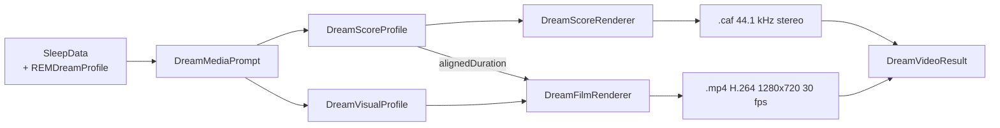

# Dream Media Generation Guide

**Scope:** how DreamWeaver turns a night of biosignals into a film, a score and a
narrative. For overall feature status see [STATUS.md](STATUS.md).

> **Historical note.** Earlier revisions of this document described OpenAI
> GPT-4o-mini and Anthropic Claude integrations, API-key configuration, a local
> heuristic engine, and an `AIEnhancedVisualizationView`. **None of that code has
> ever existed in this repository.** Those sections have been removed rather than
> archived, because they repeatedly misled debugging sessions. The plan for a real
> on-device narrative engine lives in [PRODUCT_ROADMAP.md](PRODUCT_ROADMAP.md).

---

## 1. What actually generates a dream

Two independent subsystems, in this order:

| Stage | Component | Status |
| --- | --- | --- |
| Narrative text, themes, symbolism, intensity, lucidity | `AIDreamService` | 🟡 **stub — randomised output** |
| MP4 film + original score | `DreamMediaComposer` → `DreamFilmRenderer` + `DreamScoreRenderer` | ✅ fully implemented |

The naming is misleading and predates the current design: the *media* pipeline is
the substantial part of this project, while the *narrative* service is a
placeholder.

---

## 2. Narrative service — current behaviour

`AIDreamService.interpret(session:)` does the following:

```swift
try await Task.sleep(nanoseconds: 800_000_000)   // simulated latency
let intensity = Double.random(in: 0.2...0.9)
let consciousness = Double.random(in: 0.1...0.6)
let mood = DreamMood.allCases.randomElement() ?? .peaceful
```

It then returns one of **six hardcoded narrative strings** selected by that random
mood, plus randomly shuffled entries from fixed theme and symbol pools, and
`Double.random` values for the REM and deep-sleep estimates.

**The narrative is therefore unrelated to how the user slept.** The real
`SleepSession` — including its fully computed `REMDreamProfile` — is accepted as a
parameter and ignored.

This is a release blocker. See [PRODUCT_ROADMAP.md](PRODUCT_ROADMAP.md) §1 for the
planned replacement: an on-device engine built on Apple's Foundation Models with a
deterministic biosignal-driven heuristic as the fallback. No cloud provider is
planned — a per-user API cost is incompatible with the one-time pricing model.

### Data model fields it populates

| Field | Meaning |
| --- | --- |
| `aiNarrative` | 2–3 sentence dream story |
| `aiThemes` | Identified themes, e.g. `cosmos`, `transformation` |
| `aiSymbolism` | Symbolic elements as emoji |
| `aiIntensity` | 0–1, dream vividness |
| `aiConsciousness` | 0–1, lucidity |
| `aiVisualPrompt` | Free-text art direction hint |

---

## 3. Media pipeline — the real engine



Entry point:

```swift
let result = try await DreamMediaComposer.shared.composeMedia(for: dream) { progress in
    // 0.0 ... 1.0
}
```

Requires `dream.remProfile` to be non-nil, otherwise it throws
`ComposerError.missingREMProfile`.

### 3.1 Prompt derivation

`DreamMediaPrompt` reads the `REMDreamProfile` and derives:

- **intensity** — from `intensityScore`
- **polarity** — from `moodPolarity` (negative = unsettled, positive = serene)
- **disturbance** — from `apneaSpikeCount` and `noiseSpikeCount`
- **arc** — from `heartRateTrend` and `hrvTrend`

These select a `DreamGenre`, which in turn fixes the visual style. A single seed
is derived per dream so that renders are deterministic and repeatable, while
different dreams diverge.

### 3.2 Genre and style pairing

Picture and score are always chosen together so they agree:

| `DreamGenre` | `DreamVisualProfile.Style` | Character |
| --- | --- | --- |
| `symphonic` | `auroraCathedral` | Broad, layered, luminous curtains |
| `chamber` | `pastoralDrift` | Intimate, warm, slow drift |
| `celestial` | `stellarNebula` | Sparse, cold, deep-space |
| `cinematic` | `stormHorizon` | Wide dynamics, weather fronts |
| `hardRock` | `emberTempest` | Driven, hot, high contrast |
| `industrial` | `fracture` | Percussive, glitched, fragmented |

### 3.3 Score synthesis

`DreamScoreRenderer` is a hand-written synthesiser. No sample libraries, no
third-party audio code.

- 44 100 Hz, stereo, written to `.caf`
- Tempo derived from average heart rate
- Phrase structure aligned to REM segment boundaries
- Resonant low-pass filter for pads, one-pole filters for cabinet and body
  simulation, ping-pong delay for space
- Returns a downsampled waveform array for the UI

Musical structure is covered by `DreamScoreTests` (319 lines).

### 3.4 Film synthesis

`DreamFilmRenderer` writes frames through `AVAssetWriter`.

| Property | Value |
| --- | --- |
| Codec | H.264 |
| Resolution | 1280 × 720 |
| Frame rate | 30 fps |

`DreamVisualProfile` exposes roughly 25 parameters — ribbon count and amplitude,
nebula layers, star and particle counts, bokeh, rays, curtains, comets, flare,
chroma edge, pulse, shake, glitch, grain, vignette, warmth. Each style sets them
differently, and the seeded `DreamRandom` varies them per dream.

**This is procedural synthesis, not a generative image model.** There is no
diffusion model and no Metal or SceneKit usage. The output is nonetheless unique
per session because it is driven by real physiological data.

### 3.5 Caching

`DreamMediaCache` writes to disk keyed by dream UUID:
`<uuid>-video.mp4` and `<uuid>-score.caf`. Re-opening a dream reuses the files.

> **Not yet implemented:** cache eviction. Long-term use will grow unbounded.

---

## 4. Legacy particle visualisation

`ParticleEngine` + `DreamVisualizationView` render a 60-particle SwiftUI animation.
This predates the film renderer and remains as a lightweight fallback. It is not
the primary experience.

---

## 5. Privacy

All generation is **on-device**. Nothing is transmitted anywhere — there is no
networking code in the media pipeline, no analytics SDK, and no third-party
dependency of any kind.

This is a deliberate product decision, not an accident of incompleteness. See
[PRODUCT_ROADMAP.md](PRODUCT_ROADMAP.md) §1.

---

## 6. Building and testing

```bash
./run-tests.sh                      # unit tests, both platforms
./run-tests.sh --filter DreamScoreTests
./run-tests.sh --filter DreamFilmTests
./run-tests.sh --filter DreamMediaCompositionTests
```

Project file: `Ihpone/DreamWeaver/DreamWeaver.xcodeproj`.

---

## 7. Troubleshooting

| Symptom | Cause |
| --- | --- |
| `missingREMProfile` thrown | The session has no biosignals, or every 60 s bucket exceeded the `movement <= 0.45` threshold so no REM segment was produced |
| Narrative does not match the night | Expected — the service is a stub (§2) |
| Film looks identical across dreams | Seed derivation collapsed; verify `REMDreamProfile` actually varies |
| Render never completes | Check free disk space; the writer fails silently when full |
| Dreams disappear after relaunch | Expected — there is no persistence layer. See [STATUS.md](STATUS.md) §7 |

---

## 8. Planned work

Tracked in [PRODUCT_ROADMAP.md](PRODUCT_ROADMAP.md):

- On-device narrative engine to replace the stub
- Dream Voice Journal — transcribe the spoken dream and align it to REM segments
- Vertical (9:16) and 4K render presets
- Share the rendered film and score
- Soundtrack export
- Dream fingerprint — a personal style that evolves over months
- Cache eviction policy
- Localized narrative output
