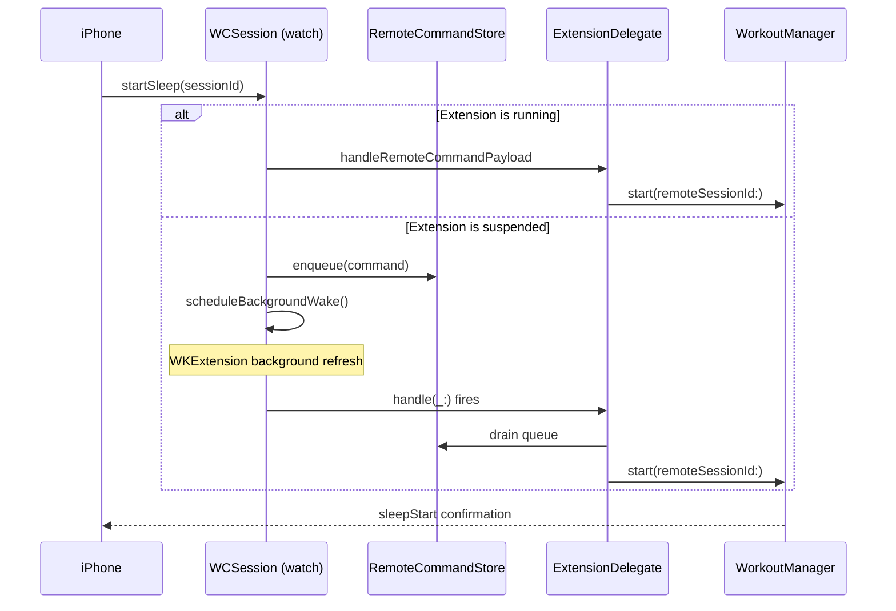

# Apple Watch Integration

**Scope:** the watch↔iPhone connectivity protocol and the data it carries.
For overall feature status see [STATUS.md](STATUS.md).

---

## 1. Overview

The Apple Watch is the sensor; the iPhone is the analyser and renderer. Dream Mode
can be started and stopped from **either** device and the other stays in sync,
including when the watch app is not running.

---

## 2. Captured signals

Twelve values are recorded per sample.

| Signal | Source | Status |
| --- | --- | --- |
| Heart rate | HealthKit | ✅ real |
| Heart rate variability (SDNN) | HealthKit | ✅ real |
| SpO₂ | HealthKit | ✅ real |
| Respiratory rate | HealthKit | ✅ real |
| Environmental audio exposure | HealthKit | ✅ real |
| Movement | CoreMotion | ✅ real — `MotionManager`, 1 Hz, normalised to `0...1` |
| Wrist temperature delta | Mixed | 🟡 partly synthesised |
| ECG confidence | — | 🟡 placeholder, no `HKElectrocardiogram` read |
| Hypertension risk | Derived | 🟡 heuristic, **not clinical** |
| Apnea risk | Derived | 🟡 heuristic, **not clinical** |
| Sleep score | Derived | 🟡 heuristic |
| REM state | `REMClassifier` | ✅ rule-based |

> The three "risk" values are heuristics with no clinical validation. They must be
> renamed before submission — see [APP_STORE_CHECKLIST.md](APP_STORE_CHECKLIST.md) §1.1.

---

## 3. Timing

| Constant | Value | Meaning |
| --- | --- | --- |
| `scheduledSampleInterval` | 1 s | Local sample capture |
| `pushInterval` | 5 s | Push to iPhone |

> Earlier versions of this document claimed a 5-**minute** cadence. That has never
> matched the code. The real cadence is 5 **seconds**, which is a known battery
> risk and is unvalidated on hardware — see
> [APP_STORE_CHECKLIST.md](APP_STORE_CHECKLIST.md) §3.1.

---

## 4. How to use it

### Start from the watch

1. Open DreamWeaver on the watch and tap **Start**.
2. Grant HealthKit permission on first launch.
3. The iPhone reflects the active session automatically.
4. Tap **Stop** on either device.

### Start from the iPhone

1. Tap **Start Dream Mode**.
2. The watch begins tracking — **even if its app is closed** (see §6).
3. The iPhone shows live heart rate and HRV streaming in.
4. Tap **Stop Tracking**; the watch stops too.

---

## 5. Message protocol

All traffic is `WCSession`. Payloads are `[String: Any]` dictionaries keyed on
`"command"`.

### iPhone → Watch

| Command | Extras | Purpose |
| --- | --- | --- |
| `startSleep` | `sessionId` | Begin a session with a phone-assigned UUID |
| `stopSleep` | `sessionId` | End the session |
| `watchStatusProbe` | `timestamp` | Ask for a status snapshot |
| `samplesRequest` | `since`, `reason` | Backfill samples the phone is missing |
| `ping` | — | Liveness check |

Application context is also used for control-state reconciliation:

```swift
["controlStateSync": true, "tracking": Bool, "sessionId": String, "start": Double, "timestamp": Double]
```

### Watch → iPhone

| Message type | Purpose |
| --- | --- |
| `sleepStart` | Session began on the watch |
| `sleepEnd` | Session ended, includes the full sample set |
| `sample` | A single live sample |
| `sampleBatch` | Batched samples (backfill or catch-up) |
| `statusRequest` | Ask the phone for its current control state |

Connection state is reported as one of `inactive`, `ready`, `tracking`.

---

## 6. Waking a sleeping watch app

`WCSession` can deliver a message while the watch extension is suspended. The flow:



Without `RemoteCommandStore`, starting Dream Mode from the iPhone with the watch
app closed silently did nothing. This was the subject of several bug-fix commits.

---

## 7. Session survival

- `WorkoutManager` persists `tracking`, `sessionStart` and `sessionId` to
  `UserDefaults` and restores them on launch (`restorePersistedSessionIfNeeded`).
- `WKExtendedRuntimeSession` keeps the runtime alive past the normal watch app
  limit.
- `reconcilePhoneControlState` resolves disagreements — if the phone believes a
  session is active and the watch does not, the watch resumes it; if they disagree
  on session ID, the watch stops the stale one and adopts the phone's.

---

## 8. Data model

`BiosignalDataPoint` is a plain `Codable` struct, **not** a SwiftData `@Model`:

```swift
struct BiosignalDataPoint: Identifiable, Codable {
    let timestamp: Date
    let heartRate: Double
    let hrv: Double
    let movement: Double
    let spo2: Double
    let respiratoryRate: Double
    let ecgConfidence: Double
    let hypertensionRisk: Double
    let wristTemperatureDelta: Double
    let sleepScore: Double
    let noiseExposure: Double
    let apneaRisk: Double
}
```

Samples land in `SleepSession.biosignals`, which is aggregated into a
`REMDreamProfile` by `SleepSession.analyzeREMProfile()`.

> Older revisions of this document showed `@Model` classes with
> `@Relationship(deleteRule: .cascade)`. That code does not exist and would not
> compile against the current model layer.

---

## 9. Requirements

| Component | Minimum |
| --- | --- |
| iOS | 26.2 |
| watchOS | 11.0 |
| Hardware | Apple Watch with heart-rate sensor, paired iPhone |
| Network | None — communication is direct, no servers involved |

---

## 10. Privacy

- All biosignal data stays on-device. There is no networking code in this project.
- The watch does not retain health data after a session is transferred.
- WatchConnectivity traffic is encrypted by the OS.

Note that "encryption at rest via SwiftData" was previously claimed here. There is
no persistence layer at all today — see [STATUS.md](STATUS.md) §7.

---

## 11. Troubleshooting

| Symptom | Checks |
| --- | --- |
| Watch not connecting | Devices paired in the Watch app; Bluetooth on; apps not force-quit |
| No heart rate | HealthKit permission granted on watch; wrist detection on; watch worn snugly. **The HealthKit entitlement is currently missing** — see [APP_STORE_CHECKLIST.md](APP_STORE_CHECKLIST.md) §0.1 |
| Data not syncing | Look for the "Receiving live data" indicator; pushes occur every 5 s |
| Charts empty | Session must have run long enough to produce samples; simulator produces no real HealthKit data |
| Watch app will not start | Physical hardware required for HealthKit; install the iPhone app first |

---

## 12. Known limitations

- Apple Watch **simulators do not provide real HealthKit data**. Meaningful testing
  requires a paired physical iPhone and Watch.
- HRV uses HealthKit SDNN rather than raw R-R intervals.
- Sleep staging is threshold-based, not machine learning, and Apple's own
  `HKCategoryType.sleepAnalysis` is never cross-checked.
- Overnight battery impact is **unmeasured**. The 5-second push cadence is
  aggressive and may materially exceed the 15% target.

---

## 13. Planned work

Tracked in [PRODUCT_ROADMAP.md](PRODUCT_ROADMAP.md) and
[APPLE_WATCH_ROADMAP.md](APPLE_WATCH_ROADMAP.md):

- Adaptive sampling to protect battery
- Bedside Mode with always-on display
- Smart Wake during light sleep
- REM-timed haptic cues for lucid dream training
- Watch complications for one-tap start
- Write sessions back to the Health app
- Real ECG capture instead of the confidence placeholder
