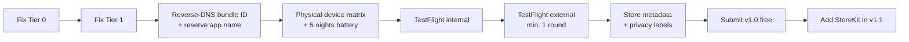

# App Store Release Checklist

**Target:** a paid DreamWeaver release for iPhone + Apple Watch.
**Current readiness: not submittable.** The blockers below are ordered by severity.

Status legend: ❌ not done · 🟡 partial · ✅ done

---

## Tier 0 — Hard blockers

The app cannot function on real hardware or be accepted without these.

### 0.1 HealthKit entitlement ✅

HealthKit entitlement files now exist for both the iOS app and watch extension,
and both targets wire them through `CODE_SIGN_ENTITLEMENTS`.

Required for **both** the iOS app and the watch app:

```xml
<key>com.apple.developer.healthkit</key>
<true/>
```

### 0.2 iOS usage descriptions ✅

The iOS target now declares `NSHealthShareUsageDescription` and
`NSHealthUpdateUsageDescription` via generated Info.plist build settings.

Add to the iOS target build settings:

- `INFOPLIST_KEY_NSHealthShareUsageDescription`
- `INFOPLIST_KEY_NSHealthUpdateUsageDescription`

Keep the wording specific about *why* — vague strings are rejected under
Guideline 5.1.1(i).

### 0.3 Privacy manifest ✅

`PrivacyInfo.xcprivacy` is present and bundled in the app. It declares:

- Collected data types — Health and Fitness, both marked *not linked* to identity
  and *not used for tracking*, purpose App Functionality
- Tracking — `NSPrivacyTracking` is `false`, no tracking domains
- Required-reason API — `NSPrivacyAccessedAPICategoryUserDefaults`, reason `CA92.1`

### 0.4 Background modes ✅

The watch extension declares `WKBackgroundModes` with `workout-processing`. The
iOS app declares `UIBackgroundModes` = `audio` so the generated dream soundtrack
keeps playing with the screen locked, via `Ihpone/DreamWeaver/Info.plist` merged
with the generated Info.plist keys.

### 0.5 Persistence ✅

`SleepDataStore` now persists `SleepData` to
`Application Support/DreamWeaver/dreams.json` using `Codable` + `FileManager`
with atomic writes. Fresh installs start empty, and data survives relaunch.

### 0.6 Remove template leftovers ✅

The unused Xcode SwiftData template `Item.swift` is no longer present in the app
sources.

---

## Tier 1 — Rejection risks

### 1.1 Medical and diagnostic claims 🟡

`apneaRisk`, `hypertensionRisk` and `sleepScore` are heuristics, but the naming
implies clinical assessment. Apple scrutinises this under Guidelines 1.4.1
(physical harm) and 5.1.3 (health data).

Two acceptable paths:

1. **Rename and reframe** (recommended for v1.0) — e.g. `breathingDisturbanceIndex`,
   `restlessnessIndex`, `restQualityIndex`, with an in-app disclaimer:
   *"DreamWeaver is not a medical device and does not diagnose, treat or prevent
   any condition."*
2. Keep the clinical framing and prepare substantiating documentation. Slower,
   and likely requires regulatory review in the EU.

Also required regardless: **do not** imply the app detects sleep apnea. Apple
reserves that claim for cleared features.

### 1.2 Permission denial handling 🟡

The iPhone shows a `HealthAccessBanner` when Health is unavailable (with a deep
link to Settings) or not yet granted, and `WorkoutManager` publishes
`healthAccessDenied`, which the watch surfaces as a notice. HealthKit still hides
*read*-grant status by design, so a silent read denial cannot be detected
directly — the banner covers the unavailable and not-yet-requested cases.

### 1.3 Onboarding ✅

`OnboardingView` runs on first launch (gated by `OnboardingGate`), explains the
product and the watch, and primes HealthKit in context. The final step never
blocks — the user can proceed even if they decline.

### 1.4 Empty states 🟡

The dashboard shows a designed empty state on a fresh install
(`DreamDashboardModel.showsEmptyState`). The remaining screens (detail, tracking)
should still be audited for their own empty states.

### 1.5 Data deletion and export ❌

The product documentation promises user-controlled deletion. Nothing implements it.
Under GDPR this is not optional for an EU release, and App Store Connect privacy
answers must match actual behaviour.

---

## Tier 2 — Store metadata and account

| Item | Status |
| --- | --- |
| Apple Developer Program membership (99 USD/yr) | 🟡 team `28TCC8Y78C` present, verify it is an organisation or paid individual account |
| Bundle ID in reverse-DNS form | ❌ currently `GJDRW.DreamWeaver`; change to `com.<org>.dreamweaver` **before** first submission — it cannot be changed afterwards |
| App name reserved in App Store Connect | ❌ "DreamWeaver" is a common name; check availability early |
| Privacy policy URL (publicly reachable) | ❌ required because health data is collected |
| Support URL | ❌ |
| App Privacy "nutrition labels" | ❌ must declare Health & Fitness collection |
| Export compliance declaration | ❌ app uses only standard HTTPS/OS crypto → usually exempt, still must be answered |
| Age rating questionnaire | ❌ |
| App icon, all required sizes, no alpha channel | 🟡 verify against current asset catalogue |
| Screenshots: 6.9" and 6.7" iPhone | ❌ |
| Apple Watch screenshots | ❌ required because a watch app is bundled |
| App preview video | optional but strongly recommended for a visual product |
| Promotional text, description, keywords | ❌ |
| Paid-app agreement, banking and tax forms | ❌ required before any paid tier goes live |

---

## Tier 3 — Quality gates before charging money

### 3.1 Overnight battery validation ❌

The product docs claim <15% overnight drain. **This has never been measured.**
Current cadence is `pushInterval = 5` seconds with a `WKExtendedRuntimeSession`
held open — aggressive enough to plausibly exceed that budget by a wide margin.

Required: at least 5 full nights on physical hardware, logging watch battery at
start and end. If drain exceeds ~20%, implement adaptive sampling (e.g. 30–60 s
while stable, faster only during detected REM).

A watch that dies at 04:00 produces one-star reviews regardless of how good the
generated art is. This is the highest-risk unknown in the project.

### 3.2 Physical-device test matrix ❌

The simulator cannot validate HealthKit or WatchConnectivity meaningfully.

| Scenario | Verified |
| --- | --- |
| Start from iPhone, watch app closed | ❌ |
| Start from watch, iPhone locked | ❌ |
| Stop from either device | ❌ |
| Airplane mode during the night, reconnect on wake | ❌ |
| Watch battery dies mid-session | ❌ |
| Session longer than 12 hours | ❌ |
| Permission denied on first launch | ❌ |
| Storage full during render | ❌ |

### 3.3 Crash-free overnight runs ❌

Success metric in the docs is zero crashes. Unverified.

### 3.4 Render performance ❌

MP4 + audio synthesis on the main-thread-adjacent path could hang the UI on older
devices. Needs profiling on the oldest supported hardware.

### 3.5 Accessibility 🟡

VoiceOver labels, Dynamic Type, and Reduce Motion support (important — this app is
built on animation). Reduce Motion is explicitly checked in App Review for
motion-heavy apps.

### 3.6 Localization ❌

Currently English-only with strings hardcoded in views. See
[PRODUCT_ROADMAP.md](PRODUCT_ROADMAP.md) for the planned rollout. Migrate to a
String Catalog (`.xcstrings`) before translating.

---

## Tier 4 — Monetization plumbing

| Item | Status |
| --- | --- |
| StoreKit 2 integration | ❌ |
| Products configured in App Store Connect | ❌ |
| Paywall screen | ❌ |
| Restore purchases (mandatory for non-consumables) | ❌ |
| Entitlement gating in the feature code | ❌ |
| Subscription terms + auto-renew disclosure (Guideline 3.1.2) | ❌ |
| Receipt / transaction verification | ❌ |
| Sandbox purchase testing | ❌ |

---

## Submission sequence



Ship v1.0 **free**. Introduce paid tiers in v1.1 once real-world battery and
reliability data exists. Launching paid on unvalidated overnight behaviour invites
refunds and one-star reviews that are very hard to recover from.
