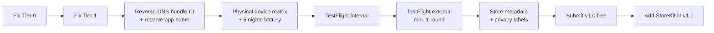

# App Store Release Checklist

**Target:** a paid DreamWeaver release for iPhone + Apple Watch.
**Current readiness: not submittable.** The blockers below are ordered by severity.

Status legend: ❌ not done · 🟡 partial · ✅ done

---

## Tier 0 — Hard blockers

The app cannot function on real hardware or be accepted without these.

### 0.1 HealthKit entitlement ❌

No `.entitlements` file exists for any target. Without the HealthKit capability,
`HKHealthStore.requestAuthorization` fails and every biosignal read returns nothing.
The simulator masks this; a physical device does not.

Required for **both** the iOS app and the watch app:

```xml
<key>com.apple.developer.healthkit</key>
<true/>
<key>com.apple.developer.healthkit.access</key>
<array/>
```

### 0.2 iOS usage descriptions ❌

The watch extension Info.plist declares them; **the iOS target does not**.
Calling HealthKit without a usage string is an immediate runtime crash and a
guaranteed rejection.

Add to the iOS target build settings:

- `INFOPLIST_KEY_NSHealthShareUsageDescription`
- `INFOPLIST_KEY_NSHealthUpdateUsageDescription`

Keep the wording specific about *why* — vague strings are rejected under
Guideline 5.1.1(i).

### 0.3 Privacy manifest ❌

`PrivacyInfo.xcprivacy` has been mandatory since 1 May 2024. App Store Connect
rejects uploads without it. Must declare:

- Collected data types — Health & Fitness, plus Identifiers if analytics are added
- Whether data is linked to identity (currently: no)
- Whether data is used for tracking (currently: no)
- Required-reason API declarations (`UserDefaults` is used → reason code `CA92.1`)

### 0.4 Background modes ❌

The watch target must declare `UIBackgroundModes` including `workout-processing`,
otherwise overnight tracking is terminated by the system.

### 0.5 Persistence ❌

`SleepDataStore` is in-memory and seeded with two `SleepData.mock()` records.
A reviewer opening a fresh install sees two dreams that were never recorded, and
any session they record vanishes on relaunch. This reads as a broken app under
Guideline 2.1 (App Completeness).

Minimum fix: persist `SleepData` to disk (`Codable` + `FileManager`, or migrate to
SwiftData) and remove the seeded mocks from production builds.

### 0.6 Remove template leftovers ❌

Delete `Ihpone/DreamWeaver/DreamWeaver/Item.swift` — an unused Xcode SwiftData
template model.

---

## Tier 1 — Rejection risks

### 1.1 Medical and diagnostic claims 🟡

`apneaRisk`, `hypertensionRisk` and `sleepScore` are heuristics, but the naming
implies clinical assessment. Apple scrutinises this under Guidelines 1.4.1
(physical harm) and 5.1.3 (health data).

Two acceptable paths:

1. **Rename and reframe** (recommended for v1.0) — e.g. `breathingDisturbanceIndex`,
   `restlessnessIndex`, `restQualityIndex`, with an in-app disclaimer:
   *"DreamWeaver is not a medical device and does not diagnose, treat or prevent
   any condition."*
2. Keep the clinical framing and prepare substantiating documentation. Slower,
   and likely requires regulatory review in the EU.

Also required regardless: **do not** imply the app detects sleep apnea. Apple
reserves that claim for cleared features.

### 1.2 Permission denial handling ❌

`WorkoutManager` only `print`s authorization errors. If a user denies HealthKit,
the app shows zeros with no explanation. Reviewers deliberately deny permissions.

Need: a visible state explaining what is unavailable and a deep link to Settings.

### 1.3 Onboarding ❌

No first-run flow. Permission prompts appear with no context, which depresses
grant rates and looks unfinished.

### 1.4 Empty states ❌

With mocks removed, a fresh install has zero dreams. Every screen needs a designed
empty state.

### 1.5 Data deletion and export ❌

The product documentation promises user-controlled deletion. Nothing implements it.
Under GDPR this is not optional for an EU release, and App Store Connect privacy
answers must match actual behaviour.

---

## Tier 2 — Store metadata and account

| Item | Status |
| --- | --- |
| Apple Developer Program membership (99 USD/yr) | 🟡 team `28TCC8Y78C` present, verify it is an organisation or paid individual account |
| Bundle ID in reverse-DNS form | ❌ currently `GJDRW.DreamWeaver`; change to `com.<org>.dreamweaver` **before** first submission — it cannot be changed afterwards |
| App name reserved in App Store Connect | ❌ "DreamWeaver" is a common name; check availability early |
| Privacy policy URL (publicly reachable) | ❌ required because health data is collected |
| Support URL | ❌ |
| App Privacy "nutrition labels" | ❌ must declare Health & Fitness collection |
| Export compliance declaration | ❌ app uses only standard HTTPS/OS crypto → usually exempt, still must be answered |
| Age rating questionnaire | ❌ |
| App icon, all required sizes, no alpha channel | 🟡 verify against current asset catalogue |
| Screenshots: 6.9" and 6.7" iPhone | ❌ |
| Apple Watch screenshots | ❌ required because a watch app is bundled |
| App preview video | optional but strongly recommended for a visual product |
| Promotional text, description, keywords | ❌ |
| Paid-app agreement, banking and tax forms | ❌ required before any paid tier goes live |

---

## Tier 3 — Quality gates before charging money

### 3.1 Overnight battery validation ❌

The product docs claim <15% overnight drain. **This has never been measured.**
Current cadence is `pushInterval = 5` seconds with a `WKExtendedRuntimeSession`
held open — aggressive enough to plausibly exceed that budget by a wide margin.

Required: at least 5 full nights on physical hardware, logging watch battery at
start and end. If drain exceeds ~20%, implement adaptive sampling (e.g. 30–60 s
while stable, faster only during detected REM).

A watch that dies at 04:00 produces one-star reviews regardless of how good the
generated art is. This is the highest-risk unknown in the project.

### 3.2 Physical-device test matrix ❌

The simulator cannot validate HealthKit or WatchConnectivity meaningfully.

| Scenario | Verified |
| --- | --- |
| Start from iPhone, watch app closed | ❌ |
| Start from watch, iPhone locked | ❌ |
| Stop from either device | ❌ |
| Airplane mode during the night, reconnect on wake | ❌ |
| Watch battery dies mid-session | ❌ |
| Session longer than 12 hours | ❌ |
| Permission denied on first launch | ❌ |
| Storage full during render | ❌ |

### 3.3 Crash-free overnight runs ❌

Success metric in the docs is zero crashes. Unverified.

### 3.4 Render performance ❌

MP4 + audio synthesis on the main-thread-adjacent path could hang the UI on older
devices. Needs profiling on the oldest supported hardware.

### 3.5 Accessibility 🟡

VoiceOver labels, Dynamic Type, and Reduce Motion support (important — this app is
built on animation). Reduce Motion is explicitly checked in App Review for
motion-heavy apps.

### 3.6 Localization ❌

Currently English-only with strings hardcoded in views. See
[PRODUCT_ROADMAP.md](PRODUCT_ROADMAP.md) for the planned rollout. Migrate to a
String Catalog (`.xcstrings`) before translating.

---

## Tier 4 — Monetization plumbing

| Item | Status |
| --- | --- |
| StoreKit 2 integration | ❌ |
| Products configured in App Store Connect | ❌ |
| Paywall screen | ❌ |
| Restore purchases (mandatory for non-consumables) | ❌ |
| Entitlement gating in the feature code | ❌ |
| Subscription terms + auto-renew disclosure (Guideline 3.1.2) | ❌ |
| Receipt / transaction verification | ❌ |
| Sandbox purchase testing | ❌ |

---

## Submission sequence



Ship v1.0 **free**. Introduce paid tiers in v1.1 once real-world battery and
reliability data exists. Launching paid on unvalidated overnight behaviour invites
refunds and one-star reviews that are very hard to recover from.
