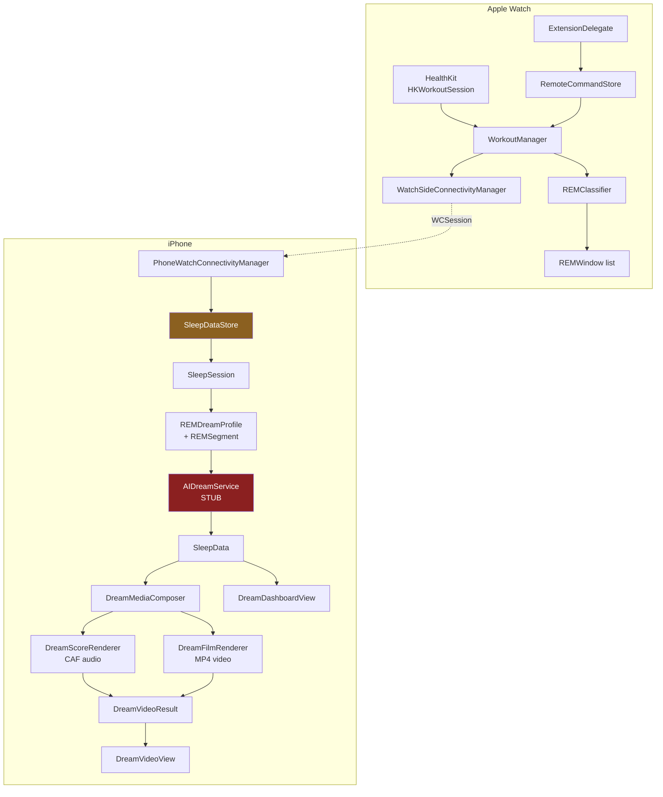
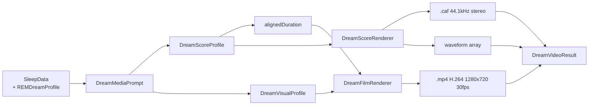

# DreamWeaver — Architecture

**Scope:** how the code is actually laid out today. For feature status see
[STATUS.md](STATUS.md).

---

## 1. Repository layout

```
Dreamweaver/
├── Shared/
│   └── REMClassifier.swift          Sleep staging — compiled into BOTH targets
├── Ihpone/                          iOS sources
│   ├── Models/
│   ├── Services/
│   ├── Views/
│   └── DreamWeaver/                 Xcode project + test targets
│       └── DreamWeaver.xcodeproj
├── Iwatch/                          watchOS sources
│   ├── Managers/
│   ├── Views/
│   ├── ExtensionDelegate.swift
│   └── WatchExtension-Info.plist
└── Doc/                             Documentation
```

The single Xcode project at `Ihpone/DreamWeaver/DreamWeaver.xcodeproj` owns all
five targets. Watch sources are referenced from `../../Iwatch/`, iOS sources from
`../../Ihpone/`, and `Shared/` is a member of both platform targets.

---

## 2. Targets

| Target | Bundle ID | Platform |
| --- | --- | --- |
| `DreamWeaver` | `GJDRW.DreamWeaver` | iOS 26.2 |
| `DreamWeaver WatchKit App` | `GJDRW.DreamWeaver.watchkitapp` | watchOS 11.0 |
| `DreamWeaver WatchKit Extension` | `GJDRW.DreamWeaver.watchkitapp.watchkitextension` | watchOS 11.0 |
| `DreamWeaverTests` | `GJDRW.DreamWeaverTests` | iOS |
| `DreamWeaverUITests` | `GJDRW.DreamWeaverUITests` | iOS |

---

## 3. End-to-end data flow



Red = stubbed. Amber = in-memory only, no persistence.

---

## 4. iOS modules

### Models

| File | Type | Role |
| --- | --- | --- |
| `SleepData.swift` | `struct`, `Codable` | A completed dream record. Also defines `REMDreamProfile`, `REMSegment`, `REMDriver`, `REMTrend` |
| `BiosignalDataPoint.swift` | `struct`, `Codable` | One timestamped sample, 12 signals |
| `DreamMood.swift` | `enum` | `peaceful`, `calm`, `intense`, `turbulent`, `chaotic`, `ethereal` + colour palettes |
| `SleepDataStore.swift` | `@MainActor ObservableObject` | In-memory dream list, active `SleepSession`, REM profiling |
| `REMWindow.swift` | `struct` | iOS-side mirror of the shared window type |

`SleepSession` (declared inside `SleepDataStore.swift`) is the mutable
in-progress recording; `SleepData` is the immutable finished record.

### Services

| File | Lines | Role |
| --- | --- | --- |
| `DreamMediaComposer.swift` | 1455 | Orchestrates media generation. Contains `DreamMediaPrompt`, `DreamGenre`, `DreamScoreProfile`, `DreamScoreRenderer`, DSP primitives |
| `DreamFilmRenderer.swift` | 1076 | `DreamVisualProfile` + AVAssetWriter frame synthesis |
| `WatchConnectivityManager.swift` | 907 | `PhoneWatchConnectivityManager`, `WCSessionDelegate`, sample ingestion |
| `AIDreamService.swift` | 138 | **Stub.** Returns randomised narratives. Also declares `SleepAIResult`, `DreamVideoScene`, `DreamVideoResult` |
| `HealthKitManager.swift` | 13 | iOS-side authorization request only |
| `ParticleEngine.swift` | 55 | Legacy particle visualisation |

### Views

| File | Role |
| --- | --- |
| `ContentView.swift` | Root, sheet routing |
| `DreamDashboardView.swift` | Hero CTA, last dream, history |
| `SleepTrackingView.swift` | Live session, paged charts, stop control |
| `DreamDetailView.swift` | Charts, AI text, share, film entry point |
| `DreamVideoView.swift` | AVPlayer, scene pager, waveform |
| `DreamVisualizationView.swift` | Particle fallback |
| `Components/MultiMetricChart.swift` | Swift Charts multi-signal plot |
| `Components/LastDreamCard.swift` | Dashboard card |
| `Components/FlexibleView.swift` | Wrapping tag layout |
| `Components/DreamWeaverWordmark.swift` | Calligraphic branding |

---

## 5. watchOS modules

| File | Role |
| --- | --- |
| `DreamWeaverWatchApp.swift` | App entry point |
| `ExtensionDelegate.swift` | Background refresh, drains `RemoteCommandStore` |
| `Managers/WorkoutManager.swift` | `HKWorkoutSession`, sampling, REM classification, extended runtime, `UserDefaults` session restore |
| `Managers/WatchConnectivityManager.swift` | `WatchSideConnectivityManager`, command handling, snapshot push |
| `Managers/RemoteCommandStore.swift` | Queues commands that arrive while the extension is asleep |
| `Views/WatchContentView.swift` | Start/stop, live vitals, HR chart, timer |
| `Views/DreamWeaverWordmark.swift` | Branding |

### Why `RemoteCommandStore` exists

`WCSession` can deliver a message while the watch extension is suspended. If
`ExtensionDelegate.shared` is `nil`, the command is enqueued and a
`WKExtension` background refresh is scheduled a few seconds out. When the
delegate wakes it drains the queue and starts the workout. Without this,
starting Dream Mode from the iPhone with the watch app closed did nothing.

---

## 6. Media generation pipeline



**Genre → visual style mapping** (kept 1:1 so picture and score agree):

| `DreamGenre` | `DreamVisualProfile.Style` |
| --- | --- |
| `symphonic` | `auroraCathedral` |
| `chamber` | `pastoralDrift` |
| `celestial` | `stellarNebula` |
| `cinematic` | `stormHorizon` |
| `hardRock` | `emberTempest` |
| `industrial` | `fracture` |

Both profiles are seeded from the same `DreamRandom` seed, so a given dream
always renders identically while different dreams differ audibly and visually.

The audio renderer is a hand-written synthesiser: oscillators, a resonant
low-pass filter, one-pole filters for cabinet/body simulation, and a ping-pong
delay. No sample libraries, no third-party audio dependencies.

---

## 7. Threading model

- `SleepDataStore`, `WorkoutManager` and both connectivity managers are `@MainActor`.
- AI interpretation runs on a detached `.userInitiated` task.
- Film rendering is `async` with a `@Sendable` progress callback.
- Audio rendering is synchronous and must not be called from the main actor
  during UI interaction.

---

## 8. Dependencies

None. No SPM packages, no CocoaPods, no Carthage. Everything is Apple frameworks:
SwiftUI, Swift Charts, HealthKit, WatchConnectivity, AVFoundation, CoreGraphics,
WatchKit, Combine.

This is a deliberate advantage — no supply-chain risk, no dependency audit for
App Review, and the privacy manifest stays simple.

---

## 9. Known architectural debt

| Issue | Impact |
| --- | --- |
| No persistence layer | Data loss on every launch; blocks journal, trends, history |
| `AIDreamService` is a stub | Narratives are random and unrelated to biosignals |
| `DreamVideoResult` lives in `AIDreamService.swift` | Misleading placement; belongs with the composer |
| Mock data seeded into the store | Users see dreams they never recorded |
| `Item.swift` template leftover | Dead SwiftData model, should be deleted |
| No dependency injection | Singletons (`.shared`) throughout; makes some paths hard to test |
| Heuristic "risk" fields | `apneaRisk` / `hypertensionRisk` imply clinical meaning they do not have |
