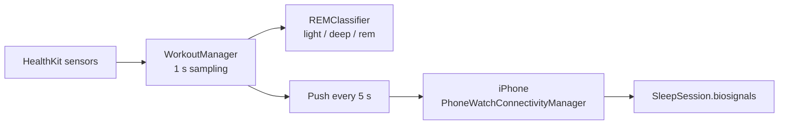

# DreamWeaver — Full Product Overview

> **Note on this file.** It was previously written in Hungarian. Documentation has
> been standardised on English because the App Store listing, review
> correspondence and any future contributors all require it. Hungarian is planned
> as the first *in-app* localization — see
> [PRODUCT_ROADMAP.md](PRODUCT_ROADMAP.md) §5.

**Concept:** *"See What Your Mind Creates."*

An iPhone + Apple Watch app family that records a night of biosignals and
synthesises a short film and an original score from what it measured — entirely
on-device.

For a shorter version see
[DreamWeaverApp-CompleteOverview.md](DreamWeaverApp-CompleteOverview.md).
For verified feature status see [STATUS.md](STATUS.md).

---

## 1. Two platforms, one experience

### 1.1 Apple Watch — the sensor

| Capability | Status |
| --- | --- |
| `HKWorkoutSession` background tracking | ✅ |
| `WKExtendedRuntimeSession` for overnight survival | ✅ |
| Heart rate, HRV (SDNN) | ✅ real HealthKit |
| SpO₂, respiratory rate | ✅ real HealthKit |
| Environmental audio exposure | ✅ real HealthKit |
| Movement / motion | ✅ |
| Wrist temperature delta | 🟡 partly synthesised |
| ECG confidence | 🟡 placeholder |
| Apnea risk, hypertension risk, sleep score | 🟡 heuristics, **not clinical** |
| Rule-based REM / deep / light staging | ✅ |
| Start and stop from the wrist | ✅ |
| Session restore after relaunch | ✅ `UserDefaults` |
| Wake from a suspended extension | ✅ `RemoteCommandStore` |
| Bedside Mode | ❌ planned |
| Smart Wake | ❌ planned |

Samples are captured every second and pushed to the phone every 5 seconds.

### 1.2 iPhone — the analyser and renderer

| Capability | Status |
| --- | --- |
| Start / stop Dream Mode | ✅ |
| Live biosignal display and timer | ✅ |
| Watch connection status | ✅ |
| Sample ingestion via WatchConnectivity | ✅ |
| REM segmentation into a `REMDreamProfile` | ✅ |
| **MP4 dream film generation** | ✅ |
| **Original score generation** | ✅ |
| Multi-metric charts | ✅ |
| Dream detail view | ✅ |
| Dream film player with scene pager and waveform | ✅ |
| Dream dashboard and history list | ✅ |
| Narrative / theme / symbolism generation | 🟡 **stub, randomised** |
| Persistence | ❌ **none** |
| Journal search, trends, insights | ❌ |
| Settings, onboarding, notifications | ❌ |
| Share the rendered film | ❌ text narrative only |
| Localization | ❌ English only |

---

## 2. Technology stack

| Layer | Implementation |
| --- | --- |
| Biosignals | HealthKit, `HKWorkoutSession`, `HKLiveWorkoutBuilder` |
| Watch runtime | `WKExtendedRuntimeSession`, `WKExtension` background refresh |
| Transport | WatchConnectivity — messages, application context, batch backfill |
| Sleep staging | Rule-based thresholds on heart rate and HRV |
| Storage | ❌ none — in-memory only |
| Narrative | 🟡 stub |
| Film | AVFoundation `AVAssetWriter` + CoreGraphics, procedural |
| Score | Custom DSP synthesiser |
| UI | SwiftUI, Swift Charts |

**No third-party dependencies of any kind.** No Metal, no SceneKit, no diffusion
model, no networking code.

---

## 3. User flow

### 3.1 Before bed

The user opens the app on either device and starts Dream Mode. If started from the
iPhone, the watch begins tracking even when its app is closed — the command is
queued and a background refresh is scheduled.

### 3.2 During sleep



If the phone is unreachable, samples accumulate on the watch and are delivered as
a batch on reconnection, or via application context.

### 3.3 On waking

Stop from either device. The session is finalised, averages are recomputed, and
`analyzeREMProfile()` buckets the samples into 60-second windows, keeping only
those with `movement <= 0.45`. Each window becomes a `REMSegment` with an
intensity score, a mood polarity and a dominant driver
(`heartRate`, `hrv`, `apnea`, `noise`, `temperature`).

### 3.4 Generation

1. A narrative is produced — **currently randomised, not derived from the data**.
2. `DreamMediaComposer` builds a `DreamMediaPrompt` from the REM profile.
3. A `DreamScoreProfile` selects tempo, genre and phrase structure.
4. `DreamScoreRenderer` synthesises a 44.1 kHz stereo CAF.
5. `DreamFilmRenderer` writes an H.264 MP4 at 1280×720, 30 fps.
6. The result is cached on disk by dream UUID.

### 3.5 Viewing

The dream card opens a detail view with paged multi-metric charts, the narrative,
theme tags, and intensity/lucidity bars. From there the film plays with its score
and a live waveform.

> **Note:** there is no "your dream is ready" notification — no notification code
> exists in the project. It is planned.

---

## 4. Dream media engine

The most developed part of the project, and the product's actual differentiator.

### 4.1 Genre and visual style

Picture and score are always selected together so they agree:

| `DreamGenre` | `DreamVisualProfile.Style` | Character |
| --- | --- | --- |
| `symphonic` | `auroraCathedral` | Broad, layered, luminous curtains |
| `chamber` | `pastoralDrift` | Intimate, warm, slow drift |
| `celestial` | `stellarNebula` | Sparse, cold, deep-space |
| `cinematic` | `stormHorizon` | Wide dynamics, weather fronts |
| `hardRock` | `emberTempest` | Driven, hot, high contrast |
| `industrial` | `fracture` | Percussive, glitched, fragmented |

### 4.2 Score

A hand-written synthesiser — oscillators, a resonant low-pass filter, one-pole
filters for cabinet and body simulation, and a ping-pong delay. Tempo derives from
average heart rate; phrase boundaries align to REM segments. No sample libraries.

### 4.3 Film

`DreamVisualProfile` exposes roughly 25 parameters — ribbons, nebula layers, stars,
particles, bokeh, rays, curtains, comets, flare, chroma edge, pulse, shake, glitch,
grain, vignette, warmth. A seeded `DreamRandom` varies them per dream, so the same
night always renders identically while different nights diverge.

This is **procedural synthesis, not a generative image model.**

### 4.4 Mood palette

`DreamMood` drives colour: `peaceful`, `calm`, `intense`, `turbulent`, `chaotic`,
`ethereal`.

---

## 5. Design language

- Dark gradient backgrounds
- Mood-specific palettes
- Calligraphic wordmark (Great Vibes) on both platforms
- Paged charts rather than dense dashboards
- Watch UI reduced to live vitals, a timer and a single action

---

## 6. Privacy

**Nothing leaves the device.** There is no networking code, no analytics SDK and no
account system anywhere in the project. HealthKit data is read on the watch,
transferred over the encrypted WatchConnectivity link, and processed on the phone.

This is a deliberate product decision. It is also what makes a one-time purchase
price viable — there is no per-user marginal cost to fund. See
[PRODUCT_ROADMAP.md](PRODUCT_ROADMAP.md) §1.

> Previous revisions claimed "SwiftData encryption at rest" and optional cloud AI
> providers. Neither exists: there is no persistence layer at all, and no AI
> provider integration has ever been written.

**Still to build:** user-controlled data deletion and export. The privacy promise
is not fully deliverable until those exist — and under GDPR they are mandatory for
an EU release.

---

## 7. Development status

### Complete

- Bidirectional watch↔phone control including suspended-app wake
- Twelve biosignals from HealthKit
- Rule-based REM staging, unit tested
- MP4 film generation, six visual styles
- Original score generation, six genres
- Charts, detail view, film player
- ~1 250 lines of unit tests
- Calligraphic branding on both platforms

### Blockers

| Blocker | Consequence |
| --- | --- |
| No persistence | All recorded sessions lost on relaunch |
| Narrative engine is a stub | Text unrelated to the user's sleep |
| HealthKit entitlement missing | Authorization fails on hardware |
| No privacy manifest | Upload rejected by App Store Connect |
| No `UIBackgroundModes` | Overnight sessions terminated |
| Mock dreams seeded into the store | Users see dreams they never recorded |

### Planned

Bedside Mode · Smart Wake · lucid dream training · dream voice journal · dream
fingerprint · Year in Review · trend analysis · PDF export · film and soundtrack
sharing · voice narration · widgets and complications · Health write-back ·
localization.

Detail and sequencing: [PRODUCT_ROADMAP.md](PRODUCT_ROADMAP.md).

---

## 8. Key innovations

1. **Biosignals become art** — not charts, but a rendered film with a matching score.
2. **Deterministic uniqueness** — seeded per dream, so it is reproducible yet personal.
3. **Two devices, one experience** — either can drive the session.
4. **Genuinely offline** — zero dependencies, zero network calls.
5. **Grounded in physiology** — HRV↔emotional state, REM↔vivid dreaming,
   movement↔narrative variability.

---

## 9. Challenges

| Challenge | Position |
| --- | --- |
| Simulators provide no real HealthKit data | Physical device testing mandatory |
| Overnight battery drain | **Unmeasured**; adaptive sampling planned |
| Render performance on older hardware | Unprofiled |
| WatchConnectivity drop-outs | Handled via context + batch backfill |
| Media cache growth | No eviction policy yet |
| Heuristic "risk" metric naming | Must be reframed before submission |

---

## 10. Success metrics

| Metric | Target | Measured? |
| --- | --- | --- |
| Heart-rate accuracy | ±5 bpm | ❌ |
| Overnight watch battery drain | <15% | ❌ **highest risk** |
| Sync reliability | ≥95% | ❌ |
| Overnight crashes | 0 | ❌ |
| App Store rating | ≥4.5★ | ❌ |

---

## 11. Project structure

```
Dreamweaver/
├── Shared/
│   └── REMClassifier.swift          compiled into both targets
├── Ihpone/
│   ├── Models/                      SleepData, BiosignalDataPoint, DreamMood,
│   │                                SleepDataStore, REMWindow
│   ├── Services/                    DreamMediaComposer, DreamFilmRenderer,
│   │                                WatchConnectivityManager, AIDreamService,
│   │                                HealthKitManager, ParticleEngine
│   ├── Views/                       Dashboard, tracking, detail, video, components
│   └── DreamWeaver/                 Xcode project + test targets
├── Iwatch/
│   ├── Managers/                    WorkoutManager, WatchConnectivityManager,
│   │                                RemoteCommandStore
│   ├── Views/                       WatchContentView, DreamWeaverWordmark
│   └── ExtensionDelegate.swift
└── Doc/
```

Full module map: [ARCHITECTURE.md](ARCHITECTURE.md).
