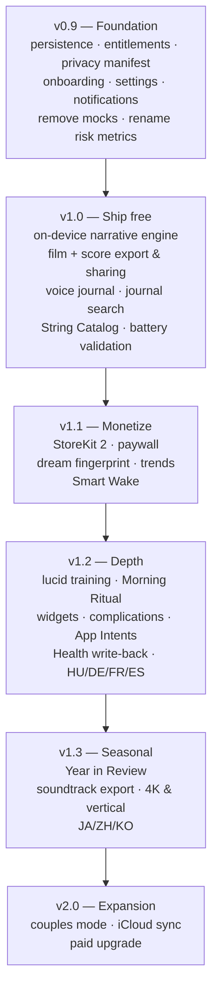

# DreamWeaver — Product Roadmap & Monetization

**Goal:** a premium, one-time-purchase app at the **$19.99–$29.99** price point on
the iPhone + Apple Watch App Store.

For current implementation state see [STATUS.md](STATUS.md). For release blockers
see [APP_STORE_CHECKLIST.md](APP_STORE_CHECKLIST.md).

---

## 1. Strategic position

### The honest market read

DreamWeaver will **not** win on sleep-tracking accuracy. AutoSleep, Pillow,
SleepWatch, Oura and Apple's own Sleep app own that ground, several of them with
years of validation data. Competing there means losing on price.

DreamWeaver's actual asset is the thing no competitor has: a **procedural film and
music engine that turns one night of biosignals into a unique, keepable,
shareable artifact**. `DreamFilmRenderer` and `DreamScoreRenderer` are ~2 500
lines of original synthesis code with no third-party dependencies. That is the
moat. Everything in this roadmap either strengthens it or removes friction around it.

**Positioning statement:**

> DreamWeaver is not a sleep tracker. It is an instrument that composes a short
> film and an original score from the night you just lived — entirely on your
> device, with no account and no cloud.

### The decision that makes $25 one-time viable

**Go fully on-device.** No server, no API keys, no per-user marginal cost.

This single architectural choice unlocks the business model:

| Consequence | Why it matters |
| --- | --- |
| Zero marginal cost per user | A one-time price is sustainable forever; a subscription is not required |
| No account, no backend | No auth, no GDPR data-processor obligations, no server bill, no outage |
| Privacy becomes a headline feature | "Your dreams never leave your device" is a real claim, not marketing |
| Simple privacy nutrition labels | Faster review, fewer rejection surfaces |
| Family Sharing is affordable | Makes $25 feel like $6 per household member |
| No API key in the binary | Removes an entire class of security incident |

A cloud-AI design would force a subscription (unbounded token cost per user) and
put DreamWeaver into direct competition with subscription sleep apps — the fight
it cannot win.

**Implication for the narrative engine:** replace the stub `AIDreamService` with
Apple's on-device Foundation Models framework, backed by a deterministic
biosignal-driven heuristic for devices without Apple Intelligence. Both run
locally, both cost nothing.

---

## 2. What actually justifies $25

A user will not pay $25 for "a sleep tracker with pretty graphics". They will pay
for **an artifact they want to keep, and a loop that gets better the longer they
use it**. Ranked by expected impact per unit of effort:

### 2.1 Dream Voice Journal — the closing of the loop ⭐ highest value

The moment the user wakes, they speak their dream out loud. On-device `Speech`
transcribes it. The app then **correlates what they remember with what the body
recorded**:

> "You described falling. Your heart rate spiked to 94 bpm at 03:12, during your
> longest REM window — 22 minutes."

This is the feature nobody else has. It converts DreamWeaver from *"an app that
guesses at my dreams"* into *"an app that shows me the physiology behind the dream
I actually had."* It also fixes the credibility problem: today the narrative is
invented, and users notice. Grounding the text in the user's own words makes it
true by construction.

It also generates the training signal for §2.2.

**Effort:** medium. `SFSpeechRecognizer` on-device, a text field, timestamp
alignment against `REMSegment`.

### 2.2 Dream Fingerprint — compounding personal value ⭐

A persistent visual and musical signature that **evolves over months** as the
system learns the user's patterns. Month one looks generic; month six looks like
*them*. Derived from long-term HRV baselines, recurring REM structure, and journal
themes.

This is the strongest anti-churn and anti-refund mechanic available: the app's
value increases with tenure, so leaving costs something. It is also the
original vision's "dream style learning" from [Instruction.md](Instruction.md),
never built.

**Effort:** medium. The renderer already accepts a seed and a full profile —
extend the seed derivation to include longitudinal history.

### 2.3 Dream Year in Review ⭐

A single film stitched from the year's most distinctive nights, with a through-
composed score. Released each December.

This is the highest-leverage *acquisition* feature in the list: it is inherently
shareable, it arrives annually with no ongoing cost, and the renderer already
exists. Spotify Wrapped demonstrated the mechanic; nobody has done it for sleep.

**Effort:** low-to-medium. Selection heuristic + concatenation through the
existing pipeline.

### 2.4 Lucid dream training

REM-timed haptic cues on the watch — a gentle tap during detected REM, calibrated
not to wake the sleeper. There is a committed community that buys $150–$250
dedicated hardware for exactly this. DreamWeaver already has REM detection and a
watch runtime.

Pair with a reality-check reminder schedule and a lucidity log.

**Effort:** medium. Requires careful haptic intensity calibration and an explicit
safety/consent flow. Frame as an experience feature, never as therapy.

### 2.5 Smart Wake

Wake within a user-chosen window, at the lightest detected sleep stage, with
escalating haptics. Table stakes for any premium sleep app — its absence is a
frequent one-star complaint.

**Effort:** medium. `REMClassifier` provides the signal; needs a reliable
watch-side alarm path and a fallback if the watch is off-wrist.

### 2.6 Vertical film export + watermark-free sharing

The MP4 already exists on disk and is **never exposed to the user**
([DreamDetailView](../Ihpone/Views/DreamDetailView.swift#L63) only shares the
narrative text). Add:

- 9:16 portrait render for Stories / Reels / TikTok
- 1080p and 4K export
- share sheet with the film, the score, or both
- a tasteful end-card in the free/trial tier only

Every shared film is free acquisition. This is the single highest ROI item in the
entire roadmap relative to effort.

**Effort:** low. `ShareLink(item: result.videoURL)` plus a second render preset.

### 2.7 Morning Ritual

A designed 90-second wake experience: the film plays, an on-device voice reads the
narrative, the user records one line of voice journal, the fingerprint updates.
One screen, one gesture, done.

Habit formation is what converts a purchase into a retained user and a
word-of-mouth recommendation.

**Effort:** low-medium. Mostly composition of existing pieces + `AVSpeechSynthesizer`.

### 2.8 Soundtrack as a standalone product

Export the generated score as an audio file; offer a "sleep sounds" mode that
plays music generated from *the user's own* prior nights. A personalised
soundscape that literally cannot be downloaded anywhere else.

**Effort:** low. The renderer already produces a CAF; add export and a playback mode.

### 2.9 Couples / household mode

Two paired sleepers, one merged film and a duet score. Novel, emotionally
resonant, and no competitor offers it. Also a natural Family Sharing justification.

**Effort:** medium-high. Requires a device-to-device pairing path.

### 2.10 System integration surface

Cheap individually, collectively they make the app feel like part of the OS:

- Home Screen and Lock Screen **widgets** (last dream, tonight's readiness)
- **Live Activity** while Dream Mode is armed
- Watch **complications** for one-tap start
- **App Intents / Shortcuts** — "Hey Siri, start Dream Mode"
- **Control Center** control (iOS 18+)
- **Health app write-back** so sessions appear alongside Apple's own data
- **Focus filter** that arms Dream Mode with Sleep Focus

**Effort:** low each. Strong perceived-quality return.

### 2.11 Physical artifacts (optional revenue extension)

Print the dream fingerprint as a poster or canvas via a fulfilment partner. Turns
an abstract app into a gift. Only pursue after the core sells.

---

## 3. Explicitly deferred

| Idea | Why not yet |
| --- | --- |
| Dream Gallery / community feed | User-generated content triggers Guideline 1.2: moderation, reporting, blocking, and a backend. Contradicts the zero-server strategy. Revisit after v2.0 |
| Cloud AI (any provider) | Forces subscription pricing, adds per-user cost, weakens the privacy claim, adds an API-key attack surface |
| Diffusion-model video generation | Not feasible on-device at acceptable quality/latency in this generation; the procedural renderer is already the differentiator |
| iCloud sync | Worth doing, but only after local persistence is solid. Opt-in, end-to-end, never a requirement |
| Clinical/diagnostic claims | Regulatory exposure far beyond the value returned. See [APP_STORE_CHECKLIST.md](APP_STORE_CHECKLIST.md) §1.1 |

---

## 4. Pricing

### Recommended: one-time purchase with a functional free trial

| Tier | Price | Contents |
| --- | --- | --- |
| **Free** | $0 | Tracking, charts, 3 dream films total, heuristic narrative, 7-day history, end-card on exports |
| **DreamWeaver** | **$24.99 one-time** | Unlimited films, on-device narrative engine, voice journal, fingerprint, Year in Review, Smart Wake, lucid training, all export formats, Family Sharing |

**Why one-time rather than subscription:**

- Marginal cost is zero once fully on-device — there is nothing to fund monthly.
- "No subscription" is now a *marketing asset*. Press and users actively seek it.
- A creative-artifact tool is a natural one-time purchase (Procreate, Halide,
  Affinity all validate this).
- Family Sharing at $24.99 across five people is trivially justifiable.

**Launch tactic:** $14.99 introductory for the first ~60 days, then $24.99. Early
buyers feel rewarded and the price rise is itself a marketing beat.

**Optional later:** paid major-version upgrades (v2.0 as a separate purchase),
which is how Things and Affinity sustain one-time pricing over years.

### If a recurring model is later required

Only if a genuine server cost appears (sync, community). Then: $3.99/month or
$24.99/year, with existing one-time buyers grandfathered permanently. Breaking
that promise would be worse than never making it.

---

## 5. Localization

English-only today, with strings hardcoded in view bodies. English is required for
the App Store listing; additional languages are a growth lever, not a launch gate.

| Phase | Work |
| --- | --- |
| **Prerequisite** | Migrate all hardcoded strings to a String Catalog (`.xcstrings`). Do this **before** translating anything, or the work is done twice |
| **Phase 1** | English (source), Hungarian |
| **Phase 2** | German, French, Spanish, Italian — largest paid-app markets in the EU |
| **Phase 3** | Japanese, Simplified Chinese, Korean — highest premium-app spend in APAC |
| **Ongoing** | Localize App Store metadata, screenshots and the preview video per market; these convert better than in-app translation alone |

Also required: right-to-left layout audit, locale-aware date/duration formatting
(`Measurement`, `DateComponentsFormatter`), and localized voice narration.

Note that the generated **narrative text** must be localized too. This is an
argument for the deterministic heuristic engine over a free-form language model —
templated narratives translate cleanly, generated prose does not.

---

## 6. Release plan

**Ship v1.0 free.** Rationale: the overnight battery profile is unvalidated (see
[APP_STORE_CHECKLIST.md](APP_STORE_CHECKLIST.md) §3.1). Charging $25 for an app
that might drain a watch overnight invites refunds and one-star reviews that
permanently suppress ranking. Gather real telemetry from a free v1.0, fix what
breaks, then charge in v1.1 with confidence.

---

## 7. Success metrics

Original targets from the product vision, plus commercial ones:

| Metric | Target | Measured? |
| --- | --- | --- |
| Heart-rate accuracy | ±5 bpm | ❌ |
| Overnight watch battery drain | <15% | ❌ **highest risk** |
| Watch↔phone sync reliability | ≥95% | ❌ |
| Overnight crash rate | 0 | ❌ |
| Film render time | <60 s on the oldest supported device | ❌ |
| Films shared per active user per month | ≥1 | ❌ |
| Day-30 retention | ≥40% | ❌ |
| Free → paid conversion | ≥5% | ❌ |
| App Store rating | ≥4.5★ | ❌ |
